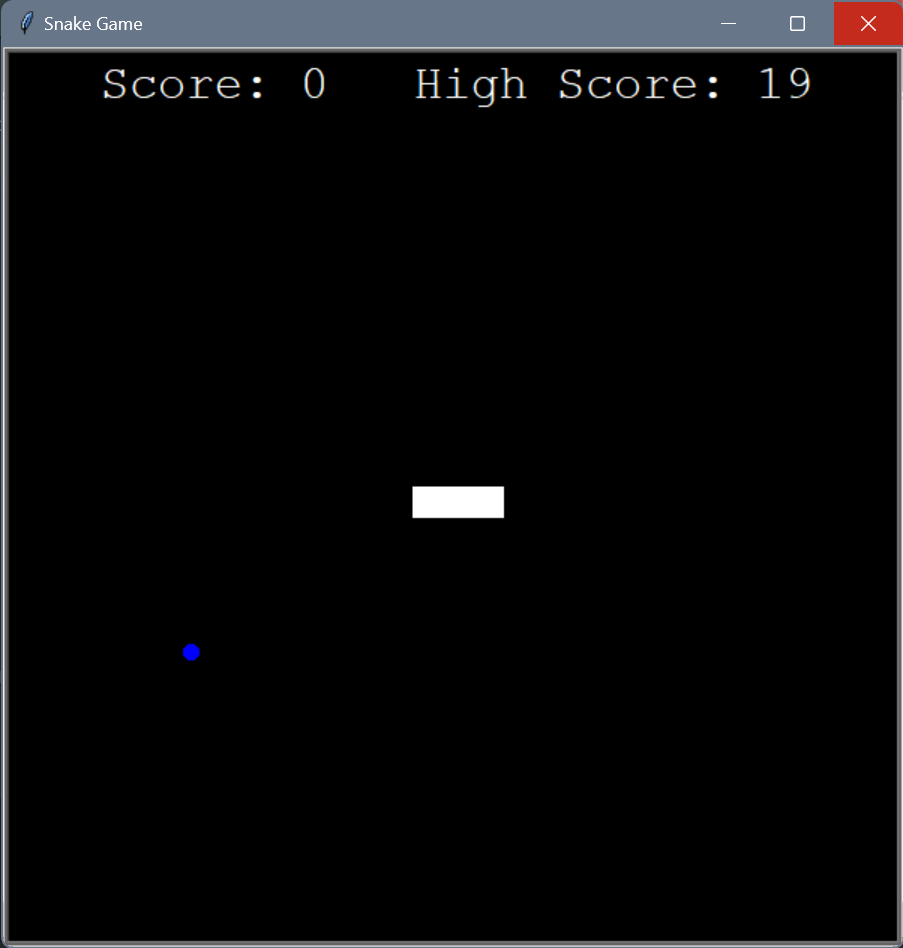

# Snake Game Project

This is a simple Snake game project created in Python using the Turtle graphics library. The goal of the game is to control the snake to collect food items and earn points while avoiding collisions with the walls and itself.

## Features
- Control the snake's direction using the arrow keys (Up, Down, Left, Right).
- Collect regular food items to increase the score.
- Collect super food items to get extra points and grow the snake longer.
- The game ends when the snake collides with the wall or itself.
- Keep track of the player's score on the scoreboard.

## Prerequisites
Before running the Snake game, make sure you have Python 3.x installed on your system.

## Installation
1. Clone or download the project to your local machine.
2. Open a terminal or command prompt and navigate to the project directory.
3. Run the game by executing the following command:
   ```
   python snake_game.py
   ```

## How to Play
- Use the arrow keys to control the snake's direction.
- Eat regular food (green) to increase your score and snake's length.
- Eat super food (red) every 5 regular food items to get extra points and a significant snake length increase.
- Avoid running into the walls or colliding with the snake's own body.

## Game Controls
- Up Arrow Key: Move the snake up.
- Down Arrow Key: Move the snake down.
- Left Arrow Key: Move the snake left.
- Right Arrow Key: Move the snake right.

## Game Rules
- The snake will continuously move in the direction it is facing.
- The game ends if the snake collides with the wall or itself.
- Regular food appears as green squares, and super food appears as red squares.
- Collect super food for bonus points and an increased snake length.

## Code Structure
- `snake_game.py`: The main game script.
- `snake.py`: Contains the Snake class.
- `food.py`: Contains the Food class for regular food.
- `super_food.py`: Contains the SuperFood class for super food.
- `scoreboard.py`: Contains the ScoreBoard class to keep track of the player's score.

## Dependencies
- This project uses the Turtle graphics library, which is typically included with Python and does not require additional installations.
## Screenshots



Enjoy playing the Snake game!
